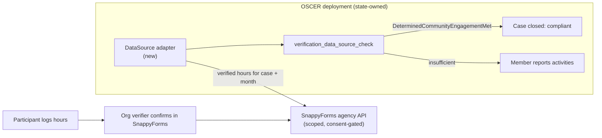
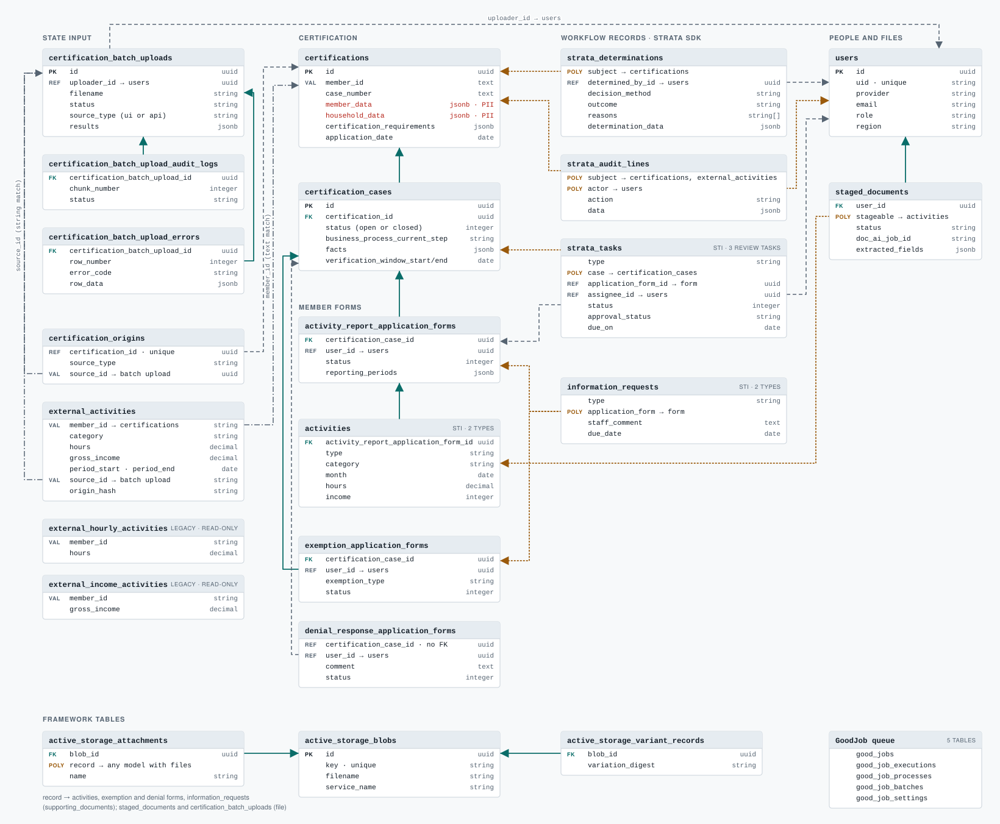

# Architecture review: SnappyForms vs Nava PBC's OSCER

**Date:** 2026-09-26 · **Status:** draft for team review · **Context:** [#26][i26] (conventions for AI-assisted work)

Every citation below points at one of these fixed commits, so line numbers stay valid:

| Repository | Ref | Note |
|---|---|---|
| snappyforms | `postgres-demo` @ `a5b23fd` | Default branch; App Hosting deploys it |
| snappyforms | `backend-django-migration-plan` @ `a683141` | Open PR #37 (Django plan) |
| [navapbc/oscer](https://github.com/navapbc/oscer) | `main` @ `b1a7561` | "Open Source Community Engagement Reporting", Apache-2.0 |
| [navapbc/strata-sdk-rails](https://github.com/navapbc/strata-sdk-rails) | `70d6869` | The revision OSCER's lockfile pins ([Gemfile.lock:1-4][o-gemlock]) |

## 1. Summary

**Recommendation: don't fork OSCER. Integrate with it, and borrow about eight of its patterns.**

- **OSCER is the state's system; SnappyForms is the verifier's.**
  - OSCER calls itself a state-owned "sidecar" for H.R. 1 community-engagement reporting ([README:33-34][o-readme]).
  - It has a registry for plugging in verification data sources ([verification_data_sources.yml:1-44][o-ds-registry]). Only mock community-engagement sources exist so far ([:76-102][o-ds-mocks]).
  - Its own working assumptions list as an open question "how volunteer/community service hours should be verified in the absence of an institutional record-keeper" ([hr1-working-assumptions.md:24][o-hr1-volunteer]). That is the record SnappyForms produces (#39).
  - That makes OSCER a place to integrate, not something to fork (see §6, D4).
- **OSCER doesn't solve "many forms" either.**
  - Adding a form, its review task and a workflow step touches about 13 files in OSCER, and there is no documented recipe. Here it is about 10 (§4, B1).
  - What OSCER adds is structure around each form: declared workflow transitions, deny-by-default authorization, rules that record reasons, and config checked at boot.
  - The declarative form-mapping engine #27 asks for has no OSCER counterpart.
- **A fork costs more than it returns.**
  - It means a Rails rewrite on an SDK at version `0.1.0`, pinned to a git revision ([Gemfile:8][o-gemfile], [version.rb:4][t-version]). Nava's own draft says its event bus loses events on a crash or deploy ([durable-events.md][t-durable]).
  - We would also have to port everything OSCER lacks: QR/TOTP shift check-in, the organization trust model, share links, PDF form generation and fax, and the consent-gated agency API.
- **The backend choice doesn't depend on OSCER.**
  - Its patterns port equally well to TypeScript and to Django.
  - PR #37 moves today's logic across "unchanged by the framework choice" ([plan:103-107][p37-services]). If that migration goes ahead, the patterns in §7 belong in its scope, so we don't port things twice.
- **#26's question: does Nava make each convention clear?**
  - Clearly for 3 of the 9 dimensions: routing and auth, folder structure, env/config.
  - Partly for 5.
  - Only implicitly, through Rails defaults, for how client and server talk.
  - Not at all for PII handling.
  - The lesson worth copying is enforcement. Pundit's after-action check makes a missing authorization call fail at runtime ([rails-conventions.md:15-30][o-r-pundit]), which is what #26 item 3's proposed route check would do for us.
  - Their AI rules have also drifted from their own code (§5, C5), so whatever rules we write need an automated check.
- **Does OSCER do what Nava's H.R. 1 page says? (§9)**
  - The case-management core is real.
  - The automation and integration claims go further than the code. Four of the 11 feature-list labels are overstated, and "no code changes", "employment data" and "vendor-agnostic" are not supported.
  - The "no action from the beneficiary" path works only if the state already holds verified data. That gap is exactly what SnappyForms fills.
- **Nava's other GitHub repos (§10).**
  - Only `oscer` is OSCER-specific. Around it sit 12 public Strata repos and 4 private ones.
  - The most useful one for us is `template-application-nextjs`: it's our stack, with CI, `jest-axe` and typed i18n ready to copy.
  - The one to ask Nava about is their private TypeScript case-management SDK.
- **OSCER's database (§11).**
  - An ERD of all 27 tables.
  - Postgres enforces only 9 foreign keys.
  - Links to users, Strata's workflow records and state-supplied data exist only in Ruby.
  - JSON contents are checked in Ruby, and fully only on the API path. The staff edit form skips the nested checks.
- **HIPAA (§12).**
  - Present: encryption at rest and in transit, session timeouts, and deny-by-default authorization.
  - Missing: a log of who viewed records, login checks on document downloads (including medical-exemption evidence), and logging that keeps PII out.
  - Nava leaves HIPAA compliance to the deploying state.

### The same goals, reached differently

| Goal | SnappyForms | OSCER |
|---|---|---|
| Render UI | 26 of 40 pages are client components calling `fetch('/api/…')` | Server-rendered ERB + Hotwire ([architecture.md][o-r-arch]) |
| Model a form | Static template config plus a PDF renderer per form ([formTemplates.ts:29-98][s-templates]) | One ActiveRecord model per form on `Strata::ApplicationForm` ([oscer_application_form.rb:1-16][o-oaf]) |
| Run a workflow | `switch` over status in helpers, then checks inside each handler ([activity.ts:10-34][s-activity]) | Declared steps and transitions, with tasks created per step ([certification_business_process.rb:23-97][o-cbp]) |
| Decide an outcome | Hours view only; decisions carry no reasons ([caseHours.ts:15-45][s-casehours]) | The rules engine keeps the reasons for each fact ([rules_engine.rb:10-16][t-rules-reasons]); determinations are stored with reason codes ([schema.rb:364-378][o-schema-det]) |
| Authorize | Hand-written checks in 73 of 91 handlers | Deny-by-default policies ([application_policy.rb][o-policy]) plus "did you authorize?" hooks ([application_controller.rb:13-14][o-appctrl]) |
| Integrate | One inbound agency API ([route:15-124][s-agencyapi]) | Adapters ([integration guide][o-integ]), a data-source registry ([verification_data_sources.yml][o-ds-registry]), an HMAC-signed API, and batch jobs |
| Configure per state | Hard-coded | YAML overrides validated at boot, plus a documented "Extension Contract" ([CUSTOMIZATION.md:123-125][o-cust-contract]) |
| Guide AI agents | One skill | 5 rule files, `claude.md`, and one skill |

## 2. Scorecard

**How to read the scores:**
- S = SnappyForms, O = OSCER.
- Criteria B and C are scored 0–3:
  - **0** = absent
  - **1** = ad hoc
  - **2** = a consistent pattern
  - **3** = documented and enforced
- The #26 dimensions (A1–A9) are not scored. For each, §3 says where Nava states it and how it is enforced.

| # | Criterion | S | O | Verdict for SnappyForms |
|---|---|:-:|:-:|---|
| B1 | Form definition & steps | 1 | 2 | **Adapt:** a registry of form definitions (§4) |
| B2 | Workflow orchestration | 1 | 2 | **Adopt** transition tables; **skip** the in-process event bus |
| B3 | Business rules | 1 | 2 | **Adapt:** rules that return reasons, with inputs listed explicitly |
| B4 | Record integrity & PII | 2 | 1 | **Keep ours**; add determination records |
| B5 | Authorization | 1 | 3 | **Adopt:** default-deny wrapper plus a CI check |
| B6 | Integration boundary | 2 | 3 | **Adapt:** OSCER's data-source contract for outbound integrations |
| B7 | Per-state config & flags | 1 | 3 | **Adopt:** typed registry validated at boot; **skip** the downstream-fork model |
| B8 | Domain overlap | — | — | **Reuse:** screener pattern (#47), HR1 assumptions (#39), i18n layout (#27) |
| C1 | Tests & quality gates | 1 | 3 | **Adopt** a CI baseline now |
| C2 | Infra & deploy | 1 | 3 | **Skip** Terraform/AWS; adopt migrations as a separate step before deploy |
| C3 | Accessibility & i18n | 0 | 2 | **Adopt** axe checks and a CI check for missing translation keys |
| C4 | Security & compliance | 1 | 2 | **Adapt** their security checklist; fix the early flags (§8) |
| C5 | AI guardrails | 1 | 2 | **Adopt** the `.claude/rules` layout plus a check for drift |
| C6 | Sustainability & dependency risk | 1 | 2 | Reuse ideas under Apache-2.0; **no** runtime dependency on Strata |

## 3. Issue #26 dimensions

For each dimension: what each repo does, whether Nava states it, and how (or whether) it is enforced.

| # | SnappyForms today | OSCER | Clear in Nava's guide? | Nava enforcement | Verdict |
|---|---|---|---|---|---|
| 1 DB schema & migrations | 34 Prisma models. Statuses are `String` columns with allowed values in `///` comments; there are 0 enums ([schema:1-7][s-schema-hdr], [:213-217][s-schema-status]). Only `ActivityRecord` uses supersede ([:249-253][s-schema-supersede]). | UUID keys ([rails-conventions.md:3-9][o-r-uuid], [claude.md:43-46][o-claude-uuid]). Migration rules: reversible, schema and data changes split, expand/contract order ([migrations.md:121-146][o-migrations]). | **Partly.** Keys and migrations are stated. PII rules are absent. The enum rule ([technical-foundation.md:49-53][o-enums]) has drifted: newer models use strings. | 6 RuboCop migration cops ([.rubocop.yml:12-29][o-rubocop]). Expand/contract is "not enforced by tooling" ([migrations.md:124][o-migrations]). | **Adapt** their migration discipline; our PII rules are stronger (B4) |
| 2 Validation | Zod in `validation.ts`, used by 31 of 91 handlers and **0 client files**. 9 handlers declare inline schemas. | ActiveModel validations on form objects and models; dedicated request/response models for the API ([software-architecture.md:23-27][o-validators], [:45-60][o-formobjects]). | **Partly.** No "single source of truth" rule. The OpenAPI spec comes from OasRails annotations plus hand-written schemas, checked by contract tests ([api.md:65-155][o-api-openapi]), not from the validations. | Convention only | **Adapt:** one schema per input, shared by client and server. PR #37 plans to generate it (Pydantic → Zod). |
| 3 Routing & auth | Middleware checks only that the cookie **exists**, on 10 path prefixes ([middleware.ts:5-16][s-mw-prefixes], [:81][s-mw-cookie]). The matcher skips all of `/api/` ([:101-103][s-mw-matcher]). 73 of 91 handlers hand-write the 401. `requireSession` has 0 callers ([session.ts:87-93][s-session]). | `ApplicationPolicy` denies every action ([application_policy.rb:3-51][o-policy]). After-action hooks raise if a controller never authorizes ([application_controller.rb:13-14][o-appctrl]). Separate logins per actor, plus HMAC for the API ([auth.md:3-7][o-r-auth]). | **Clear** ([rails-conventions.md:15-30][o-r-pundit]; the authorization ADR, [adr-authorization.md:3-5][o-adr-authz]) | **Runtime guard.** 13 of 40 controllers opt out, each explicitly. The API controller has no verify hook ([api_controller.rb:3-18][o-apictrl]). | **Adopt** the pattern, plus #26's route check |
| 4 CSS | Tailwind compiled through PostCSS. There is a custom class ([globals.css:38-52][s-globals]). The config only extends colors and radius ([tailwind.config.ts:7-38][s-tailwind]). 33 arbitrary values. | USWDS Sass tokens, plus SCSS override hooks for states ([CUSTOMIZATION.md:101-106][o-cust-scss]) | **Partly** (docs only) | None (no stylelint) | **Record** a rule: tokens only, no arbitrary values. Adopt USWDS only if a state partner requires it. |
| 5 UI components | 7 shadcn-style primitives over Radix ([package.json:39-42][s-pkg-radix]). The Dialog wrapper has 0 importers. **0 `aria-*`**; 3 of 81 `<label>`s are linked to their field. | ViewComponent + Lookbook; a USWDS form builder ([architecture.md][o-r-arch]) | **Partly.** The rule says `us_form_with` ([forms-and-i18n.md:5][o-r-forms]), but 21 views use `strata_form_with` and only 10 use `us_form_with`. | One axe scan, of the home page only ([index.spec.ts:18-21][o-axe]) | **Adapt:** one form-field component that wires label, hint and error together |
| 6 Client–server | 91 route handlers and **0 server actions**, although server actions are configured ([next.config.js:3-7][s-nextconfig]). Errors are `{error: code}` via `handleApiError` in 77 handlers ([apiError.ts:5-26][s-apierror]). | Server-rendered forms. JSON `/api` is used only for integrations ([architecture.md][o-r-arch]). It is unversioned, with "no stability guarantees" ([api.md:58-61][o-api-stability]). | **Implicit** (Rails default; never stated) | OpenAPI drift is committed back to the PR by a bot instead of failing CI ([ci-reporting-app-openapi.yml:35-56][o-openapi-bot]) | **Decide:** route handlers are the only way to mutate data (draft below) |
| 7 Folder structure | Documented in the README. The loose flow scripts now sit in `frontend/`. | A directory table ([architecture.md:3-25][o-r-arch]); `Custom::` directories for extensions ([CUSTOMIZATION.md:123-125][o-cust-contract]) | **Clear** | Rails autoloading enforces file naming | **Adopt:** a directory table in `CLAUDE.md` |
| 8 Env, secrets, config | `.env.example` lists 6 variables. `SESSION_SECRET` is listed but nothing reads it. 2 variables the code does read are missing from it. `DEMO_MODE` is `"true"` in the production config ([apphosting.yaml:55-67][s-apphosting]). | Every variable documented with its default or "Required" ([configuration.md][o-config]). Secrets go in SSM, not plain env vars ([environment-variables-and-secrets.md:9][o-secrets]). A `FEATURE_*` flag registry ([feature_flags.rb:35-111][o-flags]). | **Clear**. Their feature-flags ADR still describes AWS Evidently ([ADR:18-26][o-flags-adr]), but the app uses `FEATURE_*` env vars and `infra/` never mentions Evidently. | Config is validated at boot ([verification_data_sources.yml:12-44][o-ds-boot]); Trivy scans for secrets in CI ([vulnerability-scans.yml:58-76][o-trivy]) | **Adopt:** a typed env schema checked at boot, and a flag registry |
| 9 Dated, revisable decisions | None. `ROADMAP.md` was deleted but is still cited. | An ADR template with status and date ([template.md:3-5][o-adr-template]) | **Partly.** The ADR index still reads "[project name]" and omits the newer ADRs ([index.md:3-5][o-adr-index]). There is no review cadence. | None | **Adopt** the ADR template, plus the review cadence #26 asks for, which OSCER lacks |

### Draft `CLAUDE.md` decisions

#26 rules out changing any of these choices except item 6. So each draft records what we do today. Lines marked **⟶** are changes, and each is filed as a follow-up (§8).

1. **Schema:**
   - Prisma + Postgres; PascalCase model names, camelCase fields, `cuid()` string keys (PR #37 keeps these).
   - Status and type fields are `String` columns, with their allowed values listed in `///` comments and enforced by Zod.
   - A confirmed record is never edited in place. A correction creates a revision (`supersedesId` + `revisionNumber`) inside one transaction.
   - Before a record is confirmed, a resubmission may overwrite it in place ([resubmit:29-32][s-resubmit]).
   - Sensitive values are stored as a `*Encrypted` + `*Last4` pair via `encryption.ts`.
   - No SSN is ever persisted, including inside generated PDFs.
   - **⟶** Define each status list once (a Prisma enum or a shared Zod enum). Order schema changes as expand/contract, following [migrations.md][o-migrations].
   - Rejected: storing form data as untyped JSON blobs. OSCER shows the risk: SSN and date of birth sit unencrypted in jsonb.
   - Enforcement: convention only.
2. **Validation:**
   - One Zod schema per input, defined in `src/lib/validation.ts`, parsed at the handler boundary.
   - The server never trusts a check done on the client.
   - **⟶** Client forms import the same schema. If PR #37 lands, the schemas are generated from Pydantic.
   - Rejected: inline schemas inside handlers.
   - Enforcement: convention only; **⟶** lint for `z.object` inside `route.ts`.
3. **Routing & auth:**
   - Pages under the protected prefixes are gated by middleware, which only checks that the cookie exists. Real authorization happens in each handler.
   - `/api/agency-api` uses client credentials, never a session cookie.
   - **⟶** Wrap every handler in `withAuth(policy)` or `publicRoute()`. The wrapper builds on `requireSession`, and a CI script fails on any unwrapped `route.ts`. This is OSCER's `verify_authorized`, translated.
4. **CSS:**
   - Tailwind utilities in markup.
   - Spacing, type and color come from `tailwind.config.ts`.
   - **⟶** No arbitrary values; add a type scale to the config.
   - Rejected for now: switching to USWDS.
5. **Components:**
   - `src/components/ui` holds primitives over Radix. Radix provides the accessibility behavior.
   - `src/components` holds app-specific components.
   - **⟶** A `Field` component that ties label, hint and error to the input, plus axe checks in e2e.
6. **Client–server (the real decision):**
   - All mutations go through route handlers under `/api`. No server actions.
   - Errors take one shape, `{ error: "<snake_code>", details? }`, produced only by `handleApiError`.
   - Mutations return `{ ok: true, …resource }`.
   - The exception is `/api/agency-api`, which is a public, client-credential API.
   - Rejected: server actions. We use none today, and they would not survive PR #37's move to a Django JSON API.
   - Enforcement: **⟶** ban `"use server"` with a lint rule, and remove `experimental.serverActions`.
7. **Folders:** a directory table (copy the shape of [architecture.md][o-r-arch]).
   - **⟶** Move the loose flow scripts into `frontend/e2e/flows/`.
8. **Env, secrets & config:**
   - Every variable is listed in `.env.example` with a comment.
   - No secrets in the repo or the client bundle.
   - **⟶** A Zod env schema validated at startup, which fails in production if `CASE_DATA_ENCRYPTION_KEY` is missing ([encryption.ts:10-20][s-encryption]) or if `DEMO_MODE` is on.
9. **Revisable:**
   - Decisions are recorded as ADRs using OSCER's template: status, deciders, date.
   - `CLAUDE.md` is reviewed at each milestone.
   - **⟶** A CI check that every path and class named in `.claude/rules` actually exists (see C5).

## 4. Scaling to many forms & workflows (B1–B8)

### B1 Form definition & steps — S 1 / O 2

**SnappyForms:**
- Five templates live in a static config ([formTemplates.ts:29-98][s-templates]).
- Certification only works for PA 1938:
  - It has dedicated columns ([schema:435-450][s-schema-cert]).
  - The key is hard-coded when a request is created ([form-requests/route.ts:104][s-formreq]) and when it is finalized ([finalize:82][s-finalize]).
- Generation branches on the template key ([generate:51][s-generate]).

**Adding one form plus certification here touches about 10 places:**
1. `schema.prisma` plus a migration
2. `formTemplates.ts`
3. `validation.ts`
4. `lib/pdf/<form>.ts`
5. `formCertification.ts` and `activityLabels.ts`
6. The 7 handlers under `api/form-requests/`
7. Three forms pages, plus the activity page
8. `notify.ts`
9. The generate route
10. A flow script

**OSCER:**
- Each form subclasses `Strata::ApplicationForm`, which provides a draft → submitted lifecycle, locks the record on submit and publishes events ([application_form.rb:5-51][t-appform]). OSCER gives each form its own table ([oscer_application_form.rb:1-16][o-oaf]).
- Steps are hand-built controller actions ([exemption_application_forms_controller.rb][o-exemption-ctrl]).
- Strata ships a multi-page form DSL ([multi-page-form-flows.md][t-flows]) and generators ([generators.md][t-generators]). OSCER uses neither.

**Adding one form plus review task plus workflow step in OSCER touches about 13 places**, inferred from how the exemption form is built:
1. A migration
2. The form model
3. A review-task class
4. Case facts and accept/deny methods
5. A business-process step and its transitions
6. Reason codes and the audit mapping
7. Two controllers
8. A policy
9. Views
10. Routes
11. An information-request model, controller, policy and view (optional)
12. Locales and mailers
13. Six kinds of spec

No document describes this recipe. CUSTOMIZATION.md covers only config, locales/branding and extension points ([CUSTOMIZATION.md:23-29][o-cust-mech]); for anything else it says to file an upstream issue ([:242-248][o-cust-upstream]).

**Take:**
- A form base class with a lifecycle is the idea worth reusing.
- Neither repo has a declarative field/step/PDF-map registry, and that registry is what #27 needs.
- **Adapt:**
  - Build a `FormDefinition` registry containing the Zod schema, steps, AcroForm field map and workflow id.
  - Validate the registry at boot.
  - Generalize the certification model beyond PA 1938.

### B2 Workflow orchestration — S 1 / O 2

**SnappyForms:**
- The allowed actions for each status come from `switch` statements ([activity.ts:10-34][s-activity], [formCertification.ts:3-23][s-formcert]).
- Handlers check the status and then update in separate writes. Neither the update's `where` clause nor a transaction guards the status ([confirm:27-37][s-confirm]). Two concurrent confirms can both pass the check.
- Only 2 files use `$transaction`.

**OSCER:**
- 8 steps and 22 transitions are declared ([certification_business_process.rb:23-97][o-cbp]) on Strata's DSL ([business_process_builder.rb:57-87][t-bp]), and tasks are created per step.
- Weaknesses:
  - Events are synchronous `ActiveSupport::Notifications` calls ([event_manager.rb:29-67][t-events]).
  - Nava's own draft of 2026-09-11 lists lost events and stuck cases as consequences ([durable-events.md][t-durable]).
  - Step errors are caught by `rescue Exception` ([business_process_instance.rb:71-83][t-bp-rescue]).

**Take:**
- **Adopt** a declared from → event → to table per record type.
- Make updates conditional on the current status: `updateMany({ where: { id, status: from } })`.
- Write the audit row in the same `$transaction`.
- **Skip** the in-process event bus. If work must run asynchronously, use an outbox table.

### B3 Business rules — S 1 / O 2

- **SnappyForms:** fraud-flag thresholds are constants inside `activity.ts` ([activity.ts:6-8][s-activity]). Outcomes carry no reasons.
- **OSCER:**
  - Rules are methods over named facts ([exclusion_ruleset.rb:5-19][o-ruleset]).
  - The engine finds a rule's inputs by reading Ruby parameter names ([rules_engine.rb:53][t-rules]).
  - It records the reasons behind each result ([rules_engine.rb:10-16][t-rules-reasons]).
  - Config sets the order in which outcomes are ranked ([exclusion_determination_service.rb:41-51][o-excl-rank]).
- **Take:**
  - **Adapt:** rule functions that list their inputs explicitly and return `{ value, reasons }`.
  - Skip the parameter-name reflection. Minified JavaScript renames parameters, so it would break.

### B4 Record integrity & PII — S 2 / O 1

**SnappyForms:**
- Revisions are created inside a transaction ([revise:34][s-revise-tx]).
- 48 handlers write to the audit log, but outside the transaction ([revise:69-75][s-revise-audit]).
- Case numbers are encrypted with AES-256-GCM, with a plaintext last-4 kept for display ([schema:667-668][s-schema-case]).
- Gaps: the early flags in §8.

**OSCER:**
- Determinations and audit lines are stored as rows ([schema.rb:351-362][o-schema-audit]).
- Member SSN, date of birth, name, address and VA ICN are stored as plaintext jsonb ([member_data.rb:137-143][o-memberdata], [schema.rb:137-145][o-schema-certs]).
- `encrypts` appears nowhere. The only protection is filtering them out of logs ([filter_parameter_logging.rb:8-10][o-filter]).

**Take:**
- **Keep** our stronger PII handling.
- **Adopt** determination rows (decision + reason codes) for certifications.

### B5 Authorization — S 1 / O 3

See §3 row 3.

**Take:** **adopt.** The helper already exists:
- `requireSession` throws `UNAUTHENTICATED` ([session.ts:87-93][s-session]).
- `handleApiError` maps that error to a 401 ([apiError.ts:18-20][s-apierror]).

What's missing is a wrapper that every handler must use, and a check that fails CI when one doesn't.

### B6 Integration boundary — S 2 / O 3

**SnappyForms:** one inbound API ([route:15-124][s-agencyapi]):
- Client secrets are hashed with bcrypt.
- Calls are checked against scopes and gated on consent.
- Calls are rate-limited.
- Every outcome writes a row to `APIRequest`.

Outbound integrations (fax, state systems) have no layer of their own.

**OSCER:**
- Adapter and service base classes share an error hierarchy ([adding-third-party-data-integrations.md:5-11][o-integ]).
- The `Verification::DataSource` contract ([data_source.rb:3-64][o-ds]):
  - never returns nil;
  - turns expected failures into `:error`;
  - keeps `:skipped` distinct from "no result".
- Sources are listed in a YAML registry that is validated at boot ([verification_data_sources.yml:12-44][o-ds-boot]).
- Also: an HMAC-signed API, and batch upload via GoodJob ([architecture.md][o-r-arch]).

**Take:** **adapt** the DataSource-style contract before we integrate with fax or Compass partners.

### B7 Per-state config & feature flags — S 1 / O 3

**SnappyForms:** env booleans (`DEMO_MODE`, [demo.ts:14][s-demo]); PA-specific forms are written into the code.

**OSCER:**
- `config/custom/*.yml` holds exemption types, data sources and flags. Each file is deep-merged over defaults and validated at boot (for example [verification_data_sources.yml:12-44][o-ds-boot]).
- A `Features` registry generates helper methods and test helpers for each flag ([feature_flags.rb:35-111][o-flags]).
- States run their own downstream fork and sync from upstream ([CUSTOMIZATION.md:14-18][o-cust-fork]).
- States may add exemptions but not narrow the federally required ones ([:169-171][o-cust-narrow]).

**Take:**
- **Adopt** a typed per-state registry (forms, programs, thresholds), validated at boot, plus a flag registry.
- **Skip** the downstream-fork model. We are a multi-tenant service, not software each state deploys.

### B8 Domain overlap & reusable assets

- **#39 (Interim Final Rule):**
  - OSCER's HR1 working assumptions ([hr1-working-assumptions.md:9-12][o-hr1-month]) take a month to be a calendar month, and treat 80 hours or $580 of income as separate pathways that can't be combined.
  - Its header still says the rule is "due June 1, 2026" ([:3][o-hr1-due]). Check it against the rule as published.
- **#47 (PA screener):** OSCER's exemption screener v2 is a good match ([README:7-13][o-screener]):
  - one yes/no page per exemption type;
  - content kept in locale files;
  - no stored state, with navigation carried in the URL;
  - small ADRs written inline ([README:137-197][o-screener-adrs]).
- **#27 (translation):**
  - OSCER splits locale files into defaults, models and views, and puts the locale in the URL prefix ([internationalization.md:11-26][o-i18n-doc]).
  - But most of its routes are declared outside the `localized` block ([routes.rb:53][o-routes-api] vs [:139][o-routes-loc]), and missing translations don't raise ([development.rb:93][o-missing-tx]).
- **#27 (form mapping, AcroForm fields, signatures):** OSCER has nothing comparable. It extracts data from uploaded documents with DocAI instead ([architecture.md][o-r-arch]), and it has no PDF-generation library at all.
- **#27 (core vs. volunteer governance):**
  - OSCER draws that line with CODEOWNERS ([CODEOWNERS:3][o-codeowners]) and the Extension Contract.
  - Conventional Commits are required ([CONTRIBUTING.md:275][o-conventional]).

## 5. Delivery, quality & governance (C1–C6)

- **C1 Tests & gates — S 1 / O 3.**
  - **SnappyForms:**
    - `npm test` runs 2 assert scripts plus 3 flows against a live, seeded server ([package.json:22][s-pkg-test]).
    - A `lint` script exists but there is no ESLint config, and there is no `.github/`.
    - [middleware.test.ts:47-49][s-mw-test] expects a redirect that [middleware.ts:52-62][s-mw-proto] deliberately removed.
  - **OSCER:**
    - 194 RSpec files, with a coverage floor of 92% of lines and 70% of branches ([rails_helper.rb:17][o-simplecov]).
    - CI runs RuboCop and a dependency audit ([ci-reporting-app.yml:23-48][o-ci]).
    - 4 Playwright specs.
- **C2 Infra & deploy — S 1 / O 3.**
  - **SnappyForms:**
    - Firebase App Hosting (at most 2 instances, [apphosting.yaml:21-22][s-apphosting-inst]), with migrations run during the build ([package.json:7][s-pkg-build]).
    - DEPLOY.md is stale: it describes a `backend/` directory that doesn't exist ([DEPLOY.md:8-11][s-deploy-backend]) and says demo mode is off ([:98][s-deploy-demo]).
  - **OSCER:**
    - Nava's infrastructure template (Terraform, AWS; an Azure template also exists) ([system-architecture.md:3-8][o-sysarch]).
    - A preview environment for each PR ([pr-environment-checks.yml][o-prenv]).
    - A migrations job that runs before deploy ([deploy.yml:26-39][o-deploy]).
    - Container scans ([vulnerability-scans.yml][o-trivy]) and infrastructure scans ([ci-infra.yml:74-82][o-checkov]).
- **C3 Accessibility & i18n — S 0 / O 2.**
  - **SnappyForms:** 0 `aria-*`, 0 `role=`, 3 of 81 labels linked to their field; `lang="en"` is hard-coded ([layout.tsx:19][s-layout]); no i18n library.
  - **OSCER:** USWDS components; English and Spanish ([forms-and-i18n.md:20-22][o-r-i18n]); one axe scan (gaps in B8).
- **C4 Security & compliance — S 1 / O 2.**
  - **SnappyForms:** SECURITY.md is candid about the in-memory rate limit, the missing CSRF token and demo mode ([SECURITY.md:31-40][s-security]). The production config contradicts it (§8).
  - **OSCER:**
    - Its security checklist still has open items, such as forgery protection in production.
    - A note that there are no file uploads is out of date: uploads now exist ([application-security.md:29-32][o-appsec]).
    - Scanners run in CI ([vulnerability-scans.yml:58-76][o-trivy]), but nothing references Brakeman.
    - PII is stored in plaintext (B4).
- **C5 AI guardrails — S 1 / O 2.**
  - **SnappyForms:** one skill; no `CLAUDE.md`.
  - **OSCER:** 5 topic rules, a `claude.md` workflow ("write RSpec tests first, present for approval", [claude.md:72-76][o-claude-flow]), and an `/e2e-test` skill. Their rules have drifted from the code:
    - The rules require reading `.claude/references/strata-sdk-rails/`, which isn't in the repo ([rails-conventions.md:54][o-r-strata]).
    - They name an `ExemptionRuleset` class ([architecture.md:18][o-r-arch-ruleset], [CUSTOMIZATION.md:151-163][o-cust-ruleset]); the code has `ExclusionRuleset`.
    - They mandate `us_form_with`, but most views use `strata_form_with`.
  - **Take:** adopt the layout, and add a check that every path and class the rules name actually exists.
- **C6 Sustainability & dependency risk — S 1 / O 2.**
  - **OSCER:**
    - Apache-2.0 and owned by a Nava team ([CODEOWNERS:3][o-codeowners]), but no tagged release yet; states sync from `main` ([CUSTOMIZATION.md:14-18][o-cust-fork]).
    - `code.json` nonetheless claims "1.0.0" and "Production" ([code.json:3-5][o-codejson]).
  - **Strata:** version `0.1.0` ([version.rb:4][t-version]), pinned to a git revision ([Gemfile:8][o-gemfile]).
  - **Us:** volunteer-run. The CONTRIBUTING guide is still pending (#26, #28).

## 6. Backend direction (D1–D4)

| Option | Fit to B1–B8 | Migration cost | Time to pilot | Dependency risk | Verdict |
|---|---|---|---|---|---|
| **D1** Fork OSCER (Rails + Strata) | Gains B5–B7. B1 is no better. Loses our domain: shifts, orgs, share links, PDF forms and fax, consent API | Very high: a different product shape in a different language | Slowest | Strata `0.1.0` pinned to git; events not durable | **No** |
| **D2** Stay on TypeScript and port the patterns | Every §7 pattern ports directly | Low and incremental | Fastest | None new | **Yes**, if PR #37 is deferred |
| **D3** Django, per PR #37 | Neutral as written: a 1:1 port ([plan:24-42][p37-decisions]) | About 5–6 weeks for one engineer ([plan:284][p37-estimate]) | Delayed by the port | Low | **Yes, only with §7 items added to its scope** (don't port the code, then rewrite it) |
| **D4** Integrate with OSCER | Complements B6/B8 | Low: one adapter on OSCER's side | In parallel | Tied to OSCER's DataSource contract | **Yes, alongside D2 or D3** |

**How D4 would work:**
- Our agency API already returns consent-gated `hoursConfirmed`, `hoursRequired` and `meetsRequirement` for a monthly window ([route:15-124][s-agencyapi], [caseHours.ts:15-45][s-casehours]).
- An OSCER `Verification::DataSource` adapter could map `meetsRequirement` to the `:hours_reported_compliant` outcome, the one OSCER's mock source emits today ([mock_community_engagement.rb:18-25][o-mock-ce]).
- Registering that adapter is config, not a fork ([verification_data_sources.yml:1-44][o-ds-registry]).
- **Gap:** our endpoint is keyed by our internal case id. A state would need to look up by its own case number, for example with an encrypted-index lookup. Design that before pitching.

**Where each pattern lands, by backend:**

| OSCER pattern | TypeScript + Prisma (D2) | Django (D3) |
|---|---|---|
| Deny-by-default policies + verify hook | `withAuth(policy)` wrapper, plus a CI check that fails on unwrapped handlers | Router-level `auth=` plus per-object policy functions, plus a test that every route declares auth |
| Declared transitions | Transition map plus a status-guarded `updateMany` in `$transaction` | Same map, with `select_for_update` inside `atomic()` (PR #37 already names these) |
| Rules that return reasons | Pure functions returning `{ value, reasons }` | Same |
| DataSource contract + registry | TS interface, plus a registry validated with Zod at boot | ABC, plus Pydantic-validated settings |
| Flag registry | Typed module over env vars, parsed by Zod | Pydantic settings |

## 7. Ranked adopt list

| # | Item | Borrowed from | Effort | Why now |
|---|---|---|:-:|---|
| 1 | Default-deny handler wrapper, plus a CI check that fails on unwrapped routes | Pundit verify hooks | M | #26 item 3; 73 hand-written session checks |
| 2 | CI baseline: typecheck, unit tests, fix the stale middleware test | OSCER CI; the job list in Nava's Next.js template (§10) | S | There is no CI at all |
| 3 | Typed env/config checked at boot; production refuses the fallback key and `DEMO_MODE` | `configuration.md` + boot validation | S | Early flags 1 and 3 |
| 4 | Transition tables, updates guarded on current status, audit written in the same transaction | `BusinessProcess` | M | Race-prone check-then-update |
| 5 | ADRs (status, deciders, date) plus a dated `CLAUDE.md` with a review cadence | `docs/decisions` | S | #26 item 9 |
| 6 | `.claude/rules/` topic files, plus a check that every path and class they name exists | `.claude/rules` | S | OSCER's rules drifted within months |
| 7 | Form-definition registry (fields, steps, AcroForm map, workflow), validated at boot | `ApplicationForm` + `config/custom` | M–L | #27; certification only works for PA 1938 |
| 8 | Rules that return reasons (fraud flags, hour thresholds) | Strata rules engine | M | Decisions we can explain |
| 9 | DataSource-style contract for outbound integrations | `Verification::DataSource` | S–M | Before fax or Compass partners |
| 10 | An i18n library, CI failing on missing keys, axe checks in e2e | OSCER i18n layout; `next-intl` + `jest-axe` in Nava's Next.js template (§10) | M | #27; C3 |
| 11 | #47 screener built as config plus steps that store no state | Exemption screener v2 | S | #47 |
| 12 | An OSCER data-source adapter backed by our agency API (D4) | DataSource registry | M | Needs a partner that is adopting OSCER |

**Skip:**
- A runtime dependency on Strata or Rails.
- The in-process event bus.
- Rules that read inputs from parameter names.
- Plaintext PII in jsonb.
- Unversioned public APIs.
- The downstream-fork customization model.

## 8. Follow-ups (proposed, not filed)

**Early flags (verified; not fixed in this PR):**
1. **Demo mode is on in production.** [apphosting.yaml:55-67][s-apphosting] sets `DEMO_MODE` to `"true"`, although [SECURITY.md:35][s-security] and [DEPLOY.md:98][s-deploy-demo] say it is off. That publishes recent sign-in codes at `/dev/inbox` ([page.tsx:9-20][s-devinbox]). It is harmless while all data is fictional, but becomes an account takeover path once real users sign up.
2. **SSN last-4 is stored and shareable.** It is drawn into the PA 1938 PDF ([pa1938.ts:55-56][s-pa1938]). The PDF bytes are stored ([finalize:37-95][s-finalize]) and served through share links ([download:13-23][s-share-dl]). This contradicts [README:108-109][s-readme-ssn] and #26 item 1.
3. **Silent fallback key.** If `CASE_DATA_ENCRYPTION_KEY` is unset, the code quietly uses a hard-coded key ([encryption.ts:10-20][s-encryption]).
4. **No CI, and a stale test.** There is no `.github/` directory, and the stale middleware test from C1 would fail. That is from reading the code; nothing was run.

**Corrections to #26's "Current:" text:**
- Item 1: resubmits overwrite records in place, and an SSN reaches stored PDFs.
- Item 2: validation is not shared with the client.
- Item 3: the matcher skips all of `/api/`, not just the agency API.
- Item 4: Tailwind *is* compiled, and a custom class exists.
- Item 6: there are no server actions; all 91 endpoints are route handlers.
- Item 7: the loose scripts now live in `frontend/`.

**Stale documents:**
- `ROADMAP.md` was deleted in `a5b23fd`, but the README ([README:20][s-readme-roadmap]) and the schema header ([schema:1-7][s-schema-hdr]) still cite it.
- DEPLOY.md describes a `backend/` that doesn't exist.
- PR #37 assumes `ROADMAP.md` and `.github/` still exist at the repo root ([plan:35-37][p37-layout]).
- `docker-compose.yml` commits a local session secret and encryption key ([docker-compose.yml:35-36][s-compose]). Fine for a local stack, but #26 item 8 should say so explicitly.

## 9. Claims check: Nava's H.R. 1 Medicaid page vs the code

**Source:** [navapbc.com/hr1/medicaid](https://www.navapbc.com/hr1/medicaid), text captured 2026-09-26. Claims are quoted verbatim, and the code is read at `b1a7561`.

**Verdicts:**
- ✅ supported
- 🟡 partly (caveat in the evidence column)
- ❌ not supported by the code
- ⚪ can't be verified from the code

**Bottom line.** The case-management core is real, but the automation and integration claims go further than the code:
- In the page's 11-row "Full feature list", the code backs 7 of Nava's status labels and overstates 4:
  - ex parte verification;
  - external data;
  - Document AI;
  - notifications that integrate with a state's own system.
- Three claims in the page body aren't supported by the code at all:
  - that states don't need code changes;
  - that it connects employment data;
  - that it's vendor-agnostic.

### "Full feature list" (Nava's status in parentheses)

| Feature | Verdict | Evidence |
|---|---|---|
| Rules engine (Available) | ✅ | Strata's rules engine plus `Rules::ExclusionRuleset` ([exclusion_ruleset.rb:5-19][o-ruleset], [rules_engine.rb:53][t-rules]). Configurability is covered in the next table. |
| Ex parte verification using state data (Available) | 🟡 | Works from the verified fields in the API payload: exemptions, activities, income ([creation_service.rb:46-52][o-c-creation]). The batch CSV loses `work_hours` and `other_income_sources`: the importer maps them ([unified_record_processor.rb:133-139][o-c-importer]), but the filtered create drops fields the model doesn't define ([json.rb:22-26][o-c-json]). The docs list a `quarterly_wage_data` source ([income-data.md:190-200][o-c-income-types]) that the code doesn't allow ([external_activity.rb:39-43][o-c-sourcetypes]). |
| External data integration (VA available, others planned) | 🟡 label overstated | A real VA Lighthouse client exists ([veteran_affairs_adapter.rb:6-18][o-c-va]). But: - OSCER registers no data sources by default ([loader:43-45][o-c-defaults]), and the shipped YAML doesn't register VA. - The `va_icn` the client needs is in neither the batch CSV template ([template:1][o-c-csv]) nor the API schema. - It only fires at a 100% disability rating ([va_disability_rating.rb:20-27][o-c-va-rating]). - VA production access "requires either VA employment or a specific VA agreement" ([va-eligibility-integration.md:32][o-c-va-doc]). |
| Mobile-friendly beneficiary interface (Available) | ✅ (thin evidence) | A viewport meta tag ([application_base.html.erb:8][o-c-viewport]) and a "Mobile Chrome" Playwright project ([playwright.config.js:50-61][o-c-pw]). User research was "Desktop (primary)" ([test-plan-jan-2026.md:45][o-c-ur]). |
| Beneficiary-facing exemption screener (Available) | ✅ | Controller, YAML config and tests. Only a signed-in member with an open case can use it ([exemption_screener_controller.rb:87-103][o-c-screener]). |
| Case management tools (Available) | ✅ core, 🟡 gaps | Tasks, assignment and "pick up next" ([tasks_controller.rb:29-67][o-c-tasks]). Gaps: - Region scoping is a TODO ([staff_policy.rb:36-43][o-c-staffpolicy]), and certifications return every record (`scope.all`, [certification_policy.rb:26-31][o-c-certpolicy]). - The case tasks, documents and notes pages have routes but no actions ([routes.rb:87-91][o-c-caseroutes]). |
| Email and SMS "that integrates with existing state notification systems" (Email available, SMS coming soon) | Email ✅ · SMS label accurate · state integration ❌ | Email goes through SES only ([production.rb:97][o-c-ses]). SMS exists only as disabled Terraform ([main.tf:49-52][o-c-sms]). Webhooks are a "future enhancement" ([in-app-medicaid-flow.md:435][o-c-webhooks]) in a design marked "[ON HOLD]" ([:2][o-c-onhold]). |
| Audit-tested reporting and dashboard (In progress) | Label accurate | One admin metric, median time-to-close ([reporting_service.rb:4-18][o-c-reporting]). Nothing is audit-tested. The GitHub repo description says it "generates compliance reports", which is ❌. |
| Document AI (Available) | 🟡 label overstated | - Off by default ([feature_flags.rb:36-40][o-c-docai-flag]). - One extraction schema, for payslips ([schema.json:1-4][o-c-docai-schema]), although the guide lists W-2s, tax returns and driver's licenses ([configuring-doc-ai.md:3][o-c-docai-guide]). - It builds FROM a **private** image ([Dockerfile:3-5][o-c-docai-docker], [markdownlint-config.json:22][o-c-private]), and deploys a Terraform module pulled from the private repo over SSH, running Claude Haiku on AWS Bedrock ([main.tf:91][o-c-docai-tf], [:112][o-c-docai-model]). - A public template exposes the same API (§10). |
| Custom state branding (Available) | ✅ | SCSS, view and locale overrides ([branding.md:11-35][o-c-branding]). Changes are code edits plus a redeploy. |
| SSO integration (Available) | ✅ | OIDC for staff and members, with identity-provider groups mapped to roles ([sso_role_mapping.yml:50-58][o-c-sso-map]). Off by default ([sso.rb:33-35][o-c-sso]); SAML is out of scope ([staff-sso.md:294][o-c-saml]). |

### Claims in the page body

| Claim (quoted) | Verdict | Evidence |
|---|---|---|
| "OSCER can verify community engagement compliance without requiring any action from the beneficiary" | 🟡 | System steps run before the member is asked for anything ([certification_business_process.rb:23-97][o-cbp]), but they only evaluate data the state has already verified. Every shipped data source is a mock ([verification_data_sources.yml:76-102][o-ds-mocks]), and all are loaded in every environment ([initializer:6-13][o-c-dsinit]). ⚠️ One mock marks a member compliant if their email contains "ce-met" ([mock_community_engagement.rb:18-25][o-mock-ce]). Any deployment that doesn't edit the YAML runs it. |
| "connect data sources many state systems can’t reach, such as the U.S. Department of Veteran Affairs (VA) Lighthouse application programming interface (API) for Veteran exemptions or employment data for income compliance" | VA 🟡 · employment ❌ | VA: see the feature table above. There is no payroll or wage integration; the design doc lists payroll APIs as "future" ([income-data.md:34-37][o-c-income-future]). |
| "States do not need to change the code to adapt to policy updates" | ❌ | Config and env vars cover ordering, on/off switches, thresholds and screener text. But: - Exclusions can't be disabled ([exclusion_types.yml:7-10][o-c-excl-yml]). - Lookback defaults are hard-coded, with a "TODO: can be updated to load from some config" ([requirement_type_params.rb:24-28][o-c-lookback]). - A new rule or new determination logic has to be written in Ruby ([CUSTOMIZATION.md:209-213][o-c-cust-table]), after which you "rewire the one line that instantiates it" ([:145-149][o-c-cust-rewire]). |
| "sidecar application" / "states don’t have to adopt everything at once" | 🟡 | Data comes in through an HMAC-signed API and batch upload ([routes.rb:53][o-routes-api]). Results go back only by polling, which returns 202 until ready ([certifications_controller.rb:21-27][o-c-outcome]). An automated "not compliant" result is reported as "indeterminate" ([outcome.rb:14-15][o-c-indeterminate]). |
| "ready-to-deploy" / "Two-month MVP implementation deployed to your infrastructure" | 🟡 / ⚪ | There is no release yet; states sync from `main` ([CUSTOMIZATION.md:14-18][o-cust-fork]). The AWS install guide is a video link plus a link to the infra template ([oscer-install-with-aws-infra.md:1-6][o-c-install]). The shipped production config has no domain and HTTPS off ([prod.tf:7-10][o-c-prodtf]). The two-month timeline is a service claim. |
| "Vendor-agnostic" | ❌ as shipped | Production is wired to AWS: S3 storage ([production.rb:46][o-c-s3]), SES email, Cognito login (the only other option is a mock, [auth_service.rb:11-14][o-c-auth]), and RDS IAM database auth ([database.yml:94-96][o-c-rdsiam]). `infra/` is AWS-only; Azure is a separate template at v0.1.0 (§10). |
| "no license fees" / "Own your data and code" | ✅, with one exception | Apache-2.0, and each state runs its own fork. The exception is Document AI, which depends on a private repo. |
| "Roadmap control" / "state-driven" | 🟡 | Nava controls the upstream repo: "Final approval required from trusted Nava staff" ([understanding-open-source.md:56][o-c-approval]), and CODEOWNERS is a Nava team ([CODEOWNERS:3][o-codeowners]). Batch processing does exist, but states merge upstream changes into their forks by hand. |
| Public repo, public roadmap, "public demo days", "publish progress reports" | Repo ✅ · roadmap and demos ⚪ · progress reports ❌ | The roadmap board renders client-side, and the demo playlist ([README:178][o-c-playlist]) hit an anti-bot page, so I couldn't check either. The repo has no changelog, releases or progress reports. |
| "the only solution on the market that fully aligns with government’s long-term, no lock-in technology…" | ⚪ | Marketing |

**What this means for SnappyForms:**
- The "no action from the beneficiary" path works only if the state already holds verified data.
- OSCER's only non-mock data source is VA, and it isn't registered.
- OSCER's own assumptions leave volunteer-hour verification as an open question ([hr1-working-assumptions.md:24][o-hr1-volunteer]).
- That is the gap a SnappyForms data source would fill (D4).

If we pursue D4, plan for three things:
- Results are pull-only.
- A deployment has to remove the mock data sources.
- We need an agreed identifier for matching people (§6).

## 10. OSCER-related repositories

**How I found them:**
- Searching Nava's GitHub org for "oscer", "medicaid", "hr1" and "community engagement" returns only `oscer`.
- The rest come from links inside OSCER, a "strata" search of the org (7 repos), and the source list of Nava's documentation engine ([sources.md:10-20][x-sources]).
- Each repo was read at its HEAD commit as of 2026-09-26. Tag counts come from `git ls-remote`.

| Repo @ commit | What it is | Tie to OSCER | Last commit · tags | Value for SnappyForms |
|---|---|---|---|---|
| `strata-sdk-rails` @70d6869 | Rails engine providing cases, tasks, business processes and a rules engine | Runtime dependency ([Gemfile:8][o-gemfile]) | 2026-09 · none (`0.1.0`) | Low as code; its ideas are in §4 |
| `template-application-rails` @5505753 | Rails app template: USWDS form builder, UUIDs, S3/SES/Cognito, Pundit, i18n ([README:30-38][x-rails-features]) | OSCER's template, pinned at `v1.0.0-3-gc7f7e95` ([reporting-app.yml:2][x-oscer-railstpl]) | 2026-09-04 · 8 (v1.0.0) | Low. Explains where OSCER's conventions and AWS coupling come from. |
| `template-infra` @8b7bc38 | Terraform infrastructure template for AWS | OSCER's infra, pinned at v0.20.0 ([base.yml:2][x-oscer-infratpl]); linked 52 times | 2026-08-04 · 68 (v0.21.0) | Low for now (we use App Hosting). The most mature repo in this set. |
| `template-infra-azure` @474f45e | Terraform infrastructure template for Azure | The basis for the "vendor-agnostic" claim ([system-architecture.md:3-8][o-sysarch]) | 2026-08-20 · 1 (v0.1.0) | Low; early |
| `platform-cli` @49dc298 | `nava-platform` CLI that installs and updates templates via Copier; installed from git ([README:23][x-cli]) | How OSCER pulls in template updates | 2026-09-16 · none | Low |
| `strata` @095812a | Catalog README for the Rails, Next.js and Flask templates and the SDK ([README:47-57][x-strata]) | OSCER is "Built with Nava Strata" | 2026-01-27 · none | Reference only |
| `strata-template-documentai-api` @753ad50 | FastAPI document-extraction service on AWS Bedrock | Serves the same `/v1/documents` endpoints OSCER calls ([app.py:260][x-docai-post], [:351][x-docai-get] vs [doc_ai_adapter.rb:14-30][x-oscer-docai]). The key header name is configurable, so this is a plausible public substitute for the private image. | 2026-08-10 · 1 (v0.1.0) | Medium: an option for #27 document intake |
| `strata-documentai-api-enterprise` @bfddb23 | Multi-tenant Document AI with an admin console, labeled "Public Preview / Active Development (August 2026)" ([README:25-32][x-docai-ent]) | Successor to the template above | 2026-09-25 · none | Medium, later |
| `strata-template-rules-engine-catala` @60d6db4 | Rules written in Catala (a law-as-code language), compiled to Python and served over REST. The only example is paid leave ([paidleave.catala_en][x-catala]) | None: OSCER uses Strata's Ruby rules instead | 2026-04-20 · 1 (0.1.0) | Medium: a rules-as-code option for B3 and #27's policy mapping |
| `strata-documentation-engine` @38ce7f5 | Uses agents to generate and self-verify an agent-queryable knowledge base of the Strata repos, OSCER included ([sources.md:10-20][x-sources]) | Documents OSCER. My inference: it's the intended fix for OSCER's missing `.claude/references` folder. | 2026-09-04 · none; **no LICENSE file** | Medium: a pattern for C5 (docs that agents can trust) |
| `strata-lib-renovate` @69b13b0 | Shared Renovate (dependency-update) presets | Dependency tooling | 2026-09-16 · none | Low; the presets are copyable |
| `terraform-aws-oidc-github` @fbbf4f6 | A fork of `unfunco/terraform-aws-oidc-github` ([README:3][x-oidc]) | Linked once from OSCER's infra docs | **2022-09-28** · none | None; stale |
| `template-application-nextjs` @a0ca4c9 | Next.js 15 + React 19 template with `next-intl`, USWDS for React, Jest + `jest-axe`, Storybook, ESLint and Prettier ([package.json:30-46][x-next-pkg]) | Not OSCER, but from the same Strata template family, and it's our stack | **2026-02-17** · 8 (v0.1.0) | **High.** Its CI (tests, lint, type check, format check, app and Storybook builds, [ci workflow][x-next-ci]) and typed i18n can be copied directly for adopt items #2 and #10. |

**Not public.** Nava's own files name four repos that can't be read anonymously ([markdownlint-config.json:22][o-c-private], [sources.md:10-20][x-sources]):
- `strata-service-document-ai`: OSCER's Document AI image and Terraform source.
- `strata-sdk-case-management`: a **TypeScript** case-management SDK with config schemas and workflow "blueprints".
- `strata-unemployment` and `strata-paidleave`: example apps.

The TypeScript SDK is the one worth asking Nava about. It is the closest match to our stack and to B1–B2.

**Takeaways:**
- The template layer (infra, Rails) is mature and versioned.
- The newer pieces are early (0.1.0, public previews), and several important ones are private.
- Their docs drift here too. The Next.js template's i18n decision record chooses I18next ([0007-i18n-type-safety.md:9-18][x-next-adr]), but the template ships `next-intl`.

## 11. OSCER database ERD

*Open the image at full size to read the column names. Every column of every table is listed in [oscer-schema-reference.md](oscer-schema-reference.md), which is generated from [schema.rb][o-schema] at `b1a7561`.*

**How to read it:** arrows point from the referencing table to the table it references.
- **Solid teal:** a foreign key Postgres enforces.
- **Dashed:** an ID column with no constraint.
- **Dotted amber:** a polymorphic type-and-ID pair.
- **Dash-dot:** a link matched by value rather than by key.

The three member forms also store a `user_id` that points at `users`; those links are listed in the rows but not drawn.

**What it shows:**
- **Only 9 links are enforced.** The 27 tables have 9 foreign keys ([schema.rb:412-420][o-e-fks]). There are also 9 ID columns with no constraint, 7 polymorphic pairs, and 3 single-table-inheritance tables.
- **The certification spine is enforced.** `certifications` → `certification_cases` → activity-report and exemption forms → `activities`. The denial-response form is the exception: its `certification_case_id` has an index but no foreign key ([schema.rb:150-159][o-e-denial]).
- **`users` is referenced from 8 columns, and Postgres enforces one of them** (`staged_documents.user_id`, [schema.rb:420][o-e-fkuser]). Form owners, task assignees, batch uploaders, determinations and audit actors can all point at a user who no longer exists.
- **Strata's workflow tables attach by type and ID.** Tasks, determinations and audit lines use polymorphic pairs. Determinations always point at a certification, because `Certification` is the only model that includes `Determinable` ([certification.rb:8][o-e-determinable]).
- **State-supplied data joins by text.** `external_activities` finds its member by matching `member_id`: "no certification FK; the member's active certification is implicit" ([schema.rb:172-173][o-e-extact]). The two older tables it replaced are read-only stubs ([external_hourly_activity.rb:3-8][o-e-legacy]).

**JSON columns are checked in Ruby, not Postgres, and not on every write path.**
- The API runs every nested rule and rejects a certification that fails one before saving it ([create_request.rb:3-18][o-j-api]).
- Batch uploads validate only the requirements ([certification_service.rb:57-70][o-j-batch]). The staff edit form checks only that requirements are present ([certification.rb:19][o-j-presence], [certifications_controller.rb:41-64][o-j-staff]).
- Unknown keys are dropped without an error, and a value that isn't a JSON object becomes `nil` ([json.rb:14-31][o-j-cast]).
- `determination_data` has no defined shape, which let a double-encoded string crash the member dashboard ([issue #680][o-j-680]).

Details and citations are in [How JSON shape is enforced](oscer-schema-reference.md#how-json-shape-is-enforced).

**For SnappyForms:** our Prisma schema has no `Json` columns today ([schema.prisma][s-prisma]). If form payloads move into jsonb, keep OSCER's one-typed-object-per-column idea and close its gaps:
- One Zod schema per column, checked in the data layer so every write path goes through it.
- `.strict()` schemas, so unknown keys fail instead of vanishing.
- A `CHECK (jsonb_typeof(col) = 'object')` constraint on each column, which would have rejected #680's bad write in the database.

## 12. HIPAA readiness: what the code supports

**Short answer: partly.** OSCER has infrastructure-level safeguards, but several application-level controls HIPAA expects are missing or left to the state.
- Nava says "OSCER can support HIPAA-aligned deployments", but that compliance "is determined by how the deploying organization configures, hosts, and operates it" ([understanding-open-source.md:75-94][o-h-claims]). They describe it as "a shared responsibility" ([:21-22][o-h-shared]).
- The repo contains no HIPAA-specific configuration, no guidance on a business associate agreement, and no access-audit feature.

| Safeguard | What the code shows | Verdict |
|---|---|---|
| Encryption at rest | - The database is encrypted with its own KMS key ([main.tf:39-40][o-h-dbenc]). - The document bucket uses KMS encryption ([encryption.tf:62-69][o-h-s3enc]) and blocks public access ([access_control.tf:5-6][o-h-s3public]). - Backups run weekly to an encrypted vault ([backups.tf:9-20][o-h-backup]). - There is no field-level encryption: the member's SSN, household members' SSNs and medical flags sit as plain JSON inside the encrypted database (examples in [oscer-schema-reference.md](oscer-schema-reference.md#certifications)). | ✅ infrastructure · 🟡 application |
| Encryption in transit | Production forces SSL ([production.rb:58][o-h-ssl]), and the database connection requires SSL ([database.yml:99][o-h-dbssl]). The shipped production environment has no domain and HTTPS off ([prod.tf:7-10][o-c-prodtf]), so each state must set up certificates. | ✅ / 🟡 |
| Session management | Sessions end after 30 minutes idle ([devise.rb:9-17][o-h-timeout], [user.rb:8][o-h-timeoutable]). | ✅ |
| Access control | Policies deny by default (§3). But: - Staff scoping by region is a TODO ([staff_policy.rb:36-43][o-c-staffpolicy]), and any staff user can list every certification ([certification_policy.rb:26-31][o-c-certpolicy]). - **File downloads aren't authenticated.** OSCER adds a login check to uploads only ([authenticated_active_storage.rb:3-25][o-h-asauth]). Downloads use Rails' default blob links ([_supporting_documents.html.erb:17][o-h-blobview]), which work for anyone who has the link, and no link expiry is configured. | 🟡 · ❌ downloads (found by reading the code; not tested) |
| Audit logging | Audit lines record task pick-ups, determinations and changes to external activity ([tasks_controller.rb:31-57][o-h-audit-tasks], [determinable.rb:77][o-h-audit-det], [external_activity_service.rb:68-87][o-h-audit-ext]). Nothing records who viewed a member's record or downloaded a document. Load-balancer access logs exist ([access_logs.tf:22][o-h-alblogs]) but don't identify the user. | 🟡 |
| PII kept out of logs | Parameter filtering covers SSN and secrets ([filter_parameter_logging.rb:8-10][o-filter]). But email sends are logged with their arguments, under a "Beware PII" TODO ([notification_service.rb:6-14][o-h-notifylog]). | 🟡 |
| "No PHI or PII leaves the state systems" ([understanding-open-source.md:69][o-h-noleave]) | Mostly true when OSCER runs in the state's own AWS account. Two exceptions: - The VA integration (off by default) sends the member's VA identifier (ICN) to VA's token endpoint ([va_token_manager.rb:26-30][o-h-vaicn]). - Document AI sends payslips to Claude Haiku on AWS Bedrock, in the state's account ([main.tf:112][o-c-docai-model]). | 🟡 |
| Business associate agreement | Not addressed. The state needs a BAA with AWS that covers every service OSCER uses: Aurora, S3, SES, Cognito and Bedrock. | ⚪ |

**Medical exemptions specifically:**
- **Enabled by default:** `medical_condition`, `substance_treatment` and `received_medical_care` ([exemption_types_loader.rb:24-30][o-h-extypes]).
- **When a member claims one:** the form records the exemption type, and the evidence files go to the KMS-encrypted bucket ([exemption_application_form.rb:13][o-h-exattach], [production.rb:46][o-c-s3]). They are then served through the unauthenticated download links described above.
- **When the state sends the data:** the medically-frail flag and the dates of inpatient medical care land in `certifications.member_data` as plain JSON ([member_data.rb:153-166][o-h-medflags]).
- **The exemption screener doesn't store answers**, by design ([README:149-155][o-h-stateless]). ✅
- **Substance-use treatment** records can fall under 42 CFR Part 2, which is stricter than HIPAA. Nothing in OSCER handles Part 2 consent or redisclosure. That is a question for the state's counsel, not a verdict.

**For SnappyForms:** the same controls apply to us: authenticated document downloads, a log of who accessed records, and logging that keeps PII out. The SSN last-4 in stored PDFs (§8) is our version of this risk.

## Appendix: method

- **Where Nava states each convention:** I checked four layers in order: `.claude/rules`, then `claude.md`, then `docs/` and the ADRs, then the code and CI. I recorded the highest layer that states the convention and whether anything enforces it.
- **Counts:** grep sweeps over `frontend/src` at `a5b23fd` and `reporting-app/` at `b1a7561`. They cover handlers, auth calls, validation imports, `aria-*`, form builders, `encrypts`, specs and Pundit opt-outs.
- **"Add a form" counts:** traced from existing slices of each codebase (PA 1938 here, the exemption form in OSCER), not built.
- **Limits:**
  - Everything here comes from reading the code at those commits. I didn't run any tests or deploy either app.
  - OSCER's GitHub stats (stars, commit count, releases) were read on 2026-09-26.
  - §9 quotes Nava's page as it read on 2026-09-26; marketing pages change.
  - §10 reads each ecosystem repo at the commit listed there. Private repos were not readable.

[i26]: https://github.com/snappyforms/snappyforms/issues/26

[s-schema-hdr]: https://github.com/snappyforms/snappyforms/blob/a5b23fd/frontend/prisma/schema.prisma#L1-L7
[s-schema-status]: https://github.com/snappyforms/snappyforms/blob/a5b23fd/frontend/prisma/schema.prisma#L213-L217
[s-schema-supersede]: https://github.com/snappyforms/snappyforms/blob/a5b23fd/frontend/prisma/schema.prisma#L249-L253
[s-schema-cert]: https://github.com/snappyforms/snappyforms/blob/a5b23fd/frontend/prisma/schema.prisma#L435-L450
[s-prisma]: https://github.com/snappyforms/snappyforms/blob/a5b23fd/frontend/prisma/schema.prisma
[s-schema-case]: https://github.com/snappyforms/snappyforms/blob/a5b23fd/frontend/prisma/schema.prisma#L667-L668
[s-activity]: https://github.com/snappyforms/snappyforms/blob/a5b23fd/frontend/src/lib/activity.ts#L6-L34
[s-formcert]: https://github.com/snappyforms/snappyforms/blob/a5b23fd/frontend/src/lib/formCertification.ts#L3-L23
[s-templates]: https://github.com/snappyforms/snappyforms/blob/a5b23fd/frontend/src/lib/formTemplates.ts#L29-L98
[s-casehours]: https://github.com/snappyforms/snappyforms/blob/a5b23fd/frontend/src/lib/caseHours.ts#L15-L45
[s-confirm]: https://github.com/snappyforms/snappyforms/blob/a5b23fd/frontend/src/app/api/activity/%5Bid%5D/confirm/route.ts#L27-L37
[s-resubmit]: https://github.com/snappyforms/snappyforms/blob/a5b23fd/frontend/src/app/api/activity/%5Bid%5D/resubmit/route.ts#L29-L32
[s-revise-tx]: https://github.com/snappyforms/snappyforms/blob/a5b23fd/frontend/src/app/api/activity/%5Bid%5D/revise/route.ts#L34
[s-revise-audit]: https://github.com/snappyforms/snappyforms/blob/a5b23fd/frontend/src/app/api/activity/%5Bid%5D/revise/route.ts#L69-L75
[s-generate]: https://github.com/snappyforms/snappyforms/blob/a5b23fd/frontend/src/app/api/forms/generate/route.ts#L51
[s-formreq]: https://github.com/snappyforms/snappyforms/blob/a5b23fd/frontend/src/app/api/form-requests/route.ts#L104
[s-finalize]: https://github.com/snappyforms/snappyforms/blob/a5b23fd/frontend/src/app/api/form-requests/%5Bid%5D/finalize/route.ts#L37-L95
[s-pa1938]: https://github.com/snappyforms/snappyforms/blob/a5b23fd/frontend/src/lib/pdf/pa1938.ts#L55-L56
[s-share-dl]: https://github.com/snappyforms/snappyforms/blob/a5b23fd/frontend/src/app/api/share/%5Btoken%5D/download/route.ts#L13-L23
[s-readme-ssn]: https://github.com/snappyforms/snappyforms/blob/a5b23fd/README.md#L108-L109
[s-session]: https://github.com/snappyforms/snappyforms/blob/a5b23fd/frontend/src/lib/auth/session.ts#L87-L93
[s-apierror]: https://github.com/snappyforms/snappyforms/blob/a5b23fd/frontend/src/lib/apiError.ts#L5-L26
[s-mw-prefixes]: https://github.com/snappyforms/snappyforms/blob/a5b23fd/frontend/src/middleware.ts#L5-L16
[s-mw-cookie]: https://github.com/snappyforms/snappyforms/blob/a5b23fd/frontend/src/middleware.ts#L81
[s-mw-matcher]: https://github.com/snappyforms/snappyforms/blob/a5b23fd/frontend/src/middleware.ts#L101-L103
[s-mw-proto]: https://github.com/snappyforms/snappyforms/blob/a5b23fd/frontend/src/middleware.ts#L52-L62
[s-mw-test]: https://github.com/snappyforms/snappyforms/blob/a5b23fd/frontend/tests/middleware.test.ts#L47-L49
[s-tailwind]: https://github.com/snappyforms/snappyforms/blob/a5b23fd/frontend/tailwind.config.ts#L7-L38
[s-globals]: https://github.com/snappyforms/snappyforms/blob/a5b23fd/frontend/src/app/globals.css#L38-L52
[s-nextconfig]: https://github.com/snappyforms/snappyforms/blob/a5b23fd/frontend/next.config.js#L3-L7
[s-layout]: https://github.com/snappyforms/snappyforms/blob/a5b23fd/frontend/src/app/layout.tsx#L19
[s-apphosting]: https://github.com/snappyforms/snappyforms/blob/a5b23fd/frontend/apphosting.yaml#L55-L67
[s-devinbox]: https://github.com/snappyforms/snappyforms/blob/a5b23fd/frontend/src/app/dev/inbox/page.tsx#L9-L20
[s-encryption]: https://github.com/snappyforms/snappyforms/blob/a5b23fd/frontend/src/lib/encryption.ts#L10-L20
[s-agencyapi]: https://github.com/snappyforms/snappyforms/blob/a5b23fd/frontend/src/app/api/agency-api/v1/cases/%5BcaseId%5D/verification/route.ts#L15-L124
[s-security]: https://github.com/snappyforms/snappyforms/blob/a5b23fd/SECURITY.md#L31-L40
[s-deploy-backend]: https://github.com/snappyforms/snappyforms/blob/a5b23fd/DEPLOY.md#L8-L11
[s-deploy-demo]: https://github.com/snappyforms/snappyforms/blob/a5b23fd/DEPLOY.md#L98
[s-compose]: https://github.com/snappyforms/snappyforms/blob/a5b23fd/docker-compose.yml#L35-L36
[s-pkg-test]: https://github.com/snappyforms/snappyforms/blob/a5b23fd/frontend/package.json#L22
[s-pkg-radix]: https://github.com/snappyforms/snappyforms/blob/a5b23fd/frontend/package.json#L39-L42
[s-demo]: https://github.com/snappyforms/snappyforms/blob/a5b23fd/frontend/src/lib/demo.ts#L14
[s-apphosting-inst]: https://github.com/snappyforms/snappyforms/blob/a5b23fd/frontend/apphosting.yaml#L21-L22
[s-pkg-build]: https://github.com/snappyforms/snappyforms/blob/a5b23fd/frontend/package.json#L7
[s-readme-roadmap]: https://github.com/snappyforms/snappyforms/blob/a5b23fd/README.md#L20
[p37-decisions]: https://github.com/snappyforms/snappyforms/blob/a683141/docs/backend-django-migration-plan.md#L24-L42
[p37-services]: https://github.com/snappyforms/snappyforms/blob/a683141/docs/backend-django-migration-plan.md#L103-L107
[p37-estimate]: https://github.com/snappyforms/snappyforms/blob/a683141/docs/backend-django-migration-plan.md#L284
[p37-layout]: https://github.com/snappyforms/snappyforms/blob/a683141/docs/backend-django-migration-plan.md#L35-L37

[o-schema-det]: https://github.com/navapbc/oscer/blob/b1a7561/reporting-app/db/schema.rb#L364-L378
[o-api-openapi]: https://github.com/navapbc/oscer/blob/b1a7561/docs/reporting-app/api.md#L65-L155
[o-cust-scss]: https://github.com/navapbc/oscer/blob/b1a7561/reporting-app/CUSTOMIZATION.md#L101-L106
[o-cust-mech]: https://github.com/navapbc/oscer/blob/b1a7561/reporting-app/CUSTOMIZATION.md#L23-L29
[o-cust-upstream]: https://github.com/navapbc/oscer/blob/b1a7561/reporting-app/CUSTOMIZATION.md#L242-L248
[o-ds-boot]: https://github.com/navapbc/oscer/blob/b1a7561/reporting-app/config/custom/verification_data_sources.yml#L12-L44
[o-trivy]: https://github.com/navapbc/oscer/blob/b1a7561/.github/workflows/vulnerability-scans.yml#L58-L76
[o-excl-rank]: https://github.com/navapbc/oscer/blob/b1a7561/reporting-app/app/services/exclusion_determination_service.rb#L41-L51
[o-screener-adrs]: https://github.com/navapbc/oscer/blob/b1a7561/docs/architecture/exemption-screener-v2/README.md#L137-L197
[o-codeowners]: https://github.com/navapbc/oscer/blob/b1a7561/.github/CODEOWNERS#L3
[o-conventional]: https://github.com/navapbc/oscer/blob/b1a7561/CONTRIBUTING.md#L275
[o-prenv]: https://github.com/navapbc/oscer/blob/b1a7561/.github/workflows/pr-environment-checks.yml
[o-checkov]: https://github.com/navapbc/oscer/blob/b1a7561/.github/workflows/ci-infra.yml#L74-L82
[o-sysarch]: https://github.com/navapbc/oscer/blob/b1a7561/docs/system-architecture.md#L3-L8
[o-r-i18n]: https://github.com/navapbc/oscer/blob/b1a7561/.claude/rules/forms-and-i18n.md#L20-L22
[o-readme]: https://github.com/navapbc/oscer/blob/b1a7561/README.md#L33-L34
[o-r-arch]: https://github.com/navapbc/oscer/blob/b1a7561/.claude/rules/architecture.md#L3-L25
[o-r-arch-ruleset]: https://github.com/navapbc/oscer/blob/b1a7561/.claude/rules/architecture.md#L18
[o-r-auth]: https://github.com/navapbc/oscer/blob/b1a7561/.claude/rules/auth.md#L3-L7
[o-r-forms]: https://github.com/navapbc/oscer/blob/b1a7561/.claude/rules/forms-and-i18n.md#L5
[o-r-uuid]: https://github.com/navapbc/oscer/blob/b1a7561/.claude/rules/rails-conventions.md#L3-L9
[o-r-pundit]: https://github.com/navapbc/oscer/blob/b1a7561/.claude/rules/rails-conventions.md#L15-L30
[o-r-strata]: https://github.com/navapbc/oscer/blob/b1a7561/.claude/rules/rails-conventions.md#L54
[o-claude-uuid]: https://github.com/navapbc/oscer/blob/b1a7561/claude.md#L43-L46
[o-claude-flow]: https://github.com/navapbc/oscer/blob/b1a7561/claude.md#L72-L76
[o-migrations]: https://github.com/navapbc/oscer/blob/b1a7561/docs/reporting-app/migrations.md#L121-L146
[o-enums]: https://github.com/navapbc/oscer/blob/b1a7561/docs/reporting-app/technical-foundation.md#L49-L53
[o-validators]: https://github.com/navapbc/oscer/blob/b1a7561/docs/reporting-app/software-architecture.md#L23-L27
[o-formobjects]: https://github.com/navapbc/oscer/blob/b1a7561/docs/reporting-app/software-architecture.md#L45-L60
[o-rubocop]: https://github.com/navapbc/oscer/blob/b1a7561/reporting-app/.rubocop.yml#L12-L29
[o-schema-certs]: https://github.com/navapbc/oscer/blob/b1a7561/reporting-app/db/schema.rb#L137-L145
[o-schema-audit]: https://github.com/navapbc/oscer/blob/b1a7561/reporting-app/db/schema.rb#L351-L362
[o-memberdata]: https://github.com/navapbc/oscer/blob/b1a7561/reporting-app/app/models/certifications/member_data.rb#L137-L143
[o-filter]: https://github.com/navapbc/oscer/blob/b1a7561/reporting-app/config/initializers/filter_parameter_logging.rb#L8-L10
[o-policy]: https://github.com/navapbc/oscer/blob/b1a7561/reporting-app/app/policies/application_policy.rb#L3-L51
[o-appctrl]: https://github.com/navapbc/oscer/blob/b1a7561/reporting-app/app/controllers/application_controller.rb#L13-L14
[o-apictrl]: https://github.com/navapbc/oscer/blob/b1a7561/reporting-app/app/controllers/api_controller.rb#L3-L18
[o-routes-api]: https://github.com/navapbc/oscer/blob/b1a7561/reporting-app/config/routes.rb#L53
[o-routes-loc]: https://github.com/navapbc/oscer/blob/b1a7561/reporting-app/config/routes.rb#L139
[o-i18n-doc]: https://github.com/navapbc/oscer/blob/b1a7561/docs/reporting-app/internationalization.md#L11-L26
[o-missing-tx]: https://github.com/navapbc/oscer/blob/b1a7561/reporting-app/config/environments/development.rb#L93
[o-api-stability]: https://github.com/navapbc/oscer/blob/b1a7561/docs/reporting-app/api.md#L58-L61
[o-openapi-bot]: https://github.com/navapbc/oscer/blob/b1a7561/.github/workflows/ci-reporting-app-openapi.yml#L35-L56
[o-ci]: https://github.com/navapbc/oscer/blob/b1a7561/.github/workflows/ci-reporting-app.yml#L23-L48
[o-simplecov]: https://github.com/navapbc/oscer/blob/b1a7561/reporting-app/spec/rails_helper.rb#L17
[o-deploy]: https://github.com/navapbc/oscer/blob/b1a7561/.github/workflows/deploy.yml#L26-L39
[o-flags]: https://github.com/navapbc/oscer/blob/b1a7561/reporting-app/config/initializers/feature_flags.rb#L35-L111
[o-flags-adr]: https://github.com/navapbc/oscer/blob/b1a7561/docs/decisions/infra/2023-11-28-feature-flags-system-design.md#L18-L26
[o-secrets]: https://github.com/navapbc/oscer/blob/b1a7561/docs/infra/environment-variables-and-secrets.md#L9
[o-config]: https://github.com/navapbc/oscer/blob/b1a7561/docs/reporting-app/configuration.md
[o-cust-fork]: https://github.com/navapbc/oscer/blob/b1a7561/reporting-app/CUSTOMIZATION.md#L14-L18
[o-cust-contract]: https://github.com/navapbc/oscer/blob/b1a7561/reporting-app/CUSTOMIZATION.md#L123-L125
[o-cust-ruleset]: https://github.com/navapbc/oscer/blob/b1a7561/reporting-app/CUSTOMIZATION.md#L151-L163
[o-cust-narrow]: https://github.com/navapbc/oscer/blob/b1a7561/reporting-app/CUSTOMIZATION.md#L169-L171
[o-adr-template]: https://github.com/navapbc/oscer/blob/b1a7561/docs/decisions/template.md#L3-L5
[o-adr-index]: https://github.com/navapbc/oscer/blob/b1a7561/docs/decisions/index.md#L3-L5
[o-adr-authz]: https://github.com/navapbc/oscer/blob/b1a7561/docs/decisions/adr-authorization.md#L3-L5
[o-cbp]: https://github.com/navapbc/oscer/blob/b1a7561/reporting-app/app/business_processes/certification_business_process.rb#L23-L97
[o-oaf]: https://github.com/navapbc/oscer/blob/b1a7561/reporting-app/app/models/oscer_application_form.rb#L1-L16
[o-exemption-ctrl]: https://github.com/navapbc/oscer/blob/b1a7561/reporting-app/app/controllers/exemption_application_forms_controller.rb
[o-ruleset]: https://github.com/navapbc/oscer/blob/b1a7561/reporting-app/app/models/rules/exclusion_ruleset.rb#L5-L19
[o-ds]: https://github.com/navapbc/oscer/blob/b1a7561/reporting-app/app/services/verification/data_source.rb#L3-L64
[o-ds-registry]: https://github.com/navapbc/oscer/blob/b1a7561/reporting-app/config/custom/verification_data_sources.yml#L1-L44
[o-ds-mocks]: https://github.com/navapbc/oscer/blob/b1a7561/reporting-app/config/custom/verification_data_sources.yml#L76-L102
[o-mock-ce]: https://github.com/navapbc/oscer/blob/b1a7561/reporting-app/app/services/verification/adapters/mock_community_engagement.rb#L18-L25
[o-integ]: https://github.com/navapbc/oscer/blob/b1a7561/docs/how-to-guides/adding-third-party-data-integrations.md#L5-L11
[o-hr1-due]: https://github.com/navapbc/oscer/blob/b1a7561/docs/hr1-working-assumptions.md#L3
[o-hr1-month]: https://github.com/navapbc/oscer/blob/b1a7561/docs/hr1-working-assumptions.md#L9-L12
[o-hr1-volunteer]: https://github.com/navapbc/oscer/blob/b1a7561/docs/hr1-working-assumptions.md#L24
[o-screener]: https://github.com/navapbc/oscer/blob/b1a7561/docs/architecture/exemption-screener-v2/README.md#L7-L13
[o-appsec]: https://github.com/navapbc/oscer/blob/b1a7561/docs/reporting-app/application-security.md#L29-L32
[o-codejson]: https://github.com/navapbc/oscer/blob/b1a7561/code.json#L3-L5
[o-axe]: https://github.com/navapbc/oscer/blob/b1a7561/e2e/reporting-app/tests/index.spec.ts#L18-L21
[o-gemfile]: https://github.com/navapbc/oscer/blob/b1a7561/reporting-app/Gemfile#L8
[o-gemlock]: https://github.com/navapbc/oscer/blob/b1a7561/reporting-app/Gemfile.lock#L1-L4

[t-rules-reasons]: https://github.com/navapbc/strata-sdk-rails/blob/70d6869/app/models/strata/rules_engine.rb#L10-L16
[t-appform]: https://github.com/navapbc/strata-sdk-rails/blob/70d6869/app/models/strata/application_form.rb#L5-L51
[t-version]: https://github.com/navapbc/strata-sdk-rails/blob/70d6869/lib/strata/version.rb#L4
[t-bp]: https://github.com/navapbc/strata-sdk-rails/blob/70d6869/app/models/strata/business_process_builder.rb#L57-L87
[t-bp-rescue]: https://github.com/navapbc/strata-sdk-rails/blob/70d6869/app/models/strata/business_process_instance.rb#L71-L83
[t-events]: https://github.com/navapbc/strata-sdk-rails/blob/70d6869/app/helpers/strata/event_manager.rb#L29-L67
[t-durable]: https://github.com/navapbc/strata-sdk-rails/blob/70d6869/docs/intent/durable-events.md#L27-L58
[t-rules]: https://github.com/navapbc/strata-sdk-rails/blob/70d6869/app/models/strata/rules_engine.rb#L53
[t-flows]: https://github.com/navapbc/strata-sdk-rails/blob/70d6869/docs/multi-page-form-flows.md
[t-generators]: https://github.com/navapbc/strata-sdk-rails/blob/70d6869/docs/generators.md

[o-c-creation]: https://github.com/navapbc/oscer/blob/b1a7561/reporting-app/app/services/certifications/creation_service.rb#L46-L52
[o-c-importer]: https://github.com/navapbc/oscer/blob/b1a7561/reporting-app/app/services/unified_record_processor.rb#L133-L139
[o-c-json]: https://github.com/navapbc/oscer/blob/b1a7561/reporting-app/lib/active_model/type/json.rb#L22-L26
[o-c-income-types]: https://github.com/navapbc/oscer/blob/b1a7561/docs/architecture/income-data/income-data.md#L190-L200
[o-c-sourcetypes]: https://github.com/navapbc/oscer/blob/b1a7561/reporting-app/app/models/external_activity.rb#L39-L43
[o-c-va]: https://github.com/navapbc/oscer/blob/b1a7561/reporting-app/app/adapters/veteran_affairs_adapter.rb#L6-L18
[o-c-defaults]: https://github.com/navapbc/oscer/blob/b1a7561/reporting-app/app/services/verification_data_sources_loader.rb#L43-L45
[o-c-csv]: https://github.com/navapbc/oscer/blob/b1a7561/reporting-app/public/certification_batch_upload_template.csv#L1
[o-c-va-rating]: https://github.com/navapbc/oscer/blob/b1a7561/reporting-app/app/services/verification/adapters/va_disability_rating.rb#L20-L27
[o-c-va-doc]: https://github.com/navapbc/oscer/blob/b1a7561/docs/architecture/va-eligibility-integration/va-eligibility-integration.md#L32
[o-c-viewport]: https://github.com/navapbc/oscer/blob/b1a7561/reporting-app/app/views/layouts/application_base.html.erb#L8
[o-c-pw]: https://github.com/navapbc/oscer/blob/b1a7561/e2e/playwright.config.js#L50-L61
[o-c-ur]: https://github.com/navapbc/oscer/blob/b1a7561/docs/user-research/homepage-report-activities-flow/test-plan-jan-2026.md#L45
[o-c-screener]: https://github.com/navapbc/oscer/blob/b1a7561/reporting-app/app/controllers/exemption_screener_controller.rb#L87-L103
[o-c-tasks]: https://github.com/navapbc/oscer/blob/b1a7561/reporting-app/app/controllers/tasks_controller.rb#L29-L67
[o-c-staffpolicy]: https://github.com/navapbc/oscer/blob/b1a7561/reporting-app/app/policies/staff_policy.rb#L36-L43
[o-c-certpolicy]: https://github.com/navapbc/oscer/blob/b1a7561/reporting-app/app/policies/certification_policy.rb#L26-L31
[o-c-caseroutes]: https://github.com/navapbc/oscer/blob/b1a7561/reporting-app/config/routes.rb#L87-L91
[o-c-ses]: https://github.com/navapbc/oscer/blob/b1a7561/reporting-app/config/environments/production.rb#L97
[o-c-sms]: https://github.com/navapbc/oscer/blob/b1a7561/infra/reporting-app/app-config/main.tf#L49-L52
[o-c-onhold]: https://github.com/navapbc/oscer/blob/b1a7561/docs/architecture/in-app-flow/in-app-medicaid-flow.md#L2
[o-c-webhooks]: https://github.com/navapbc/oscer/blob/b1a7561/docs/architecture/in-app-flow/in-app-medicaid-flow.md#L435
[o-c-reporting]: https://github.com/navapbc/oscer/blob/b1a7561/reporting-app/app/services/reporting_service.rb#L4-L18
[o-c-docai-flag]: https://github.com/navapbc/oscer/blob/b1a7561/reporting-app/config/initializers/feature_flags.rb#L36-L40
[o-c-docai-schema]: https://github.com/navapbc/oscer/blob/b1a7561/document-ai/schema.json#L1-L4
[o-c-docai-guide]: https://github.com/navapbc/oscer/blob/b1a7561/docs/how-to-guides/configuring-doc-ai.md#L3
[o-c-docai-docker]: https://github.com/navapbc/oscer/blob/b1a7561/document-ai/Dockerfile#L3-L5
[o-c-private]: https://github.com/navapbc/oscer/blob/b1a7561/.github/workflows/markdownlint-config.json#L22
[o-c-docai-tf]: https://github.com/navapbc/oscer/blob/b1a7561/infra/document-ai/service/main.tf#L91
[o-c-docai-model]: https://github.com/navapbc/oscer/blob/b1a7561/infra/document-ai/service/main.tf#L112
[o-c-branding]: https://github.com/navapbc/oscer/blob/b1a7561/docs/how-to-guides/branding.md#L11-L35
[o-c-sso-map]: https://github.com/navapbc/oscer/blob/b1a7561/reporting-app/config/sso_role_mapping.yml#L50-L58
[o-c-sso]: https://github.com/navapbc/oscer/blob/b1a7561/reporting-app/config/initializers/sso.rb#L33-L35
[o-c-saml]: https://github.com/navapbc/oscer/blob/b1a7561/docs/architecture/staff-sso/staff-sso.md#L294
[o-c-dsinit]: https://github.com/navapbc/oscer/blob/b1a7561/reporting-app/config/initializers/verification_data_sources.rb#L6-L13
[o-c-income-future]: https://github.com/navapbc/oscer/blob/b1a7561/docs/architecture/income-data/income-data.md#L34-L37
[o-c-excl-yml]: https://github.com/navapbc/oscer/blob/b1a7561/reporting-app/config/custom/exclusion_types.yml#L7-L10
[o-c-lookback]: https://github.com/navapbc/oscer/blob/b1a7561/reporting-app/app/models/certifications/requirement_type_params.rb#L24-L28
[o-c-cust-table]: https://github.com/navapbc/oscer/blob/b1a7561/reporting-app/CUSTOMIZATION.md#L209-L213
[o-c-cust-rewire]: https://github.com/navapbc/oscer/blob/b1a7561/reporting-app/CUSTOMIZATION.md#L145-L149
[o-c-outcome]: https://github.com/navapbc/oscer/blob/b1a7561/reporting-app/app/controllers/api/certifications_controller.rb#L21-L27
[o-c-indeterminate]: https://github.com/navapbc/oscer/blob/b1a7561/reporting-app/app/models/api/certifications/outcome.rb#L14-L15
[o-c-install]: https://github.com/navapbc/oscer/blob/b1a7561/docs/how-to-guides/oscer-install-with-aws-infra.md#L1-L6
[o-c-prodtf]: https://github.com/navapbc/oscer/blob/b1a7561/infra/reporting-app/app-config/prod.tf#L7-L10
[o-c-s3]: https://github.com/navapbc/oscer/blob/b1a7561/reporting-app/config/environments/production.rb#L46
[o-c-auth]: https://github.com/navapbc/oscer/blob/b1a7561/reporting-app/app/services/auth_service.rb#L11-L14
[o-c-rdsiam]: https://github.com/navapbc/oscer/blob/b1a7561/reporting-app/config/database.yml#L94-L96
[o-c-approval]: https://github.com/navapbc/oscer/blob/b1a7561/docs/how-to-guides/understanding-open-source.md#L56
[o-c-playlist]: https://github.com/navapbc/oscer/blob/b1a7561/README.md#L178

[x-sources]: https://github.com/navapbc/strata-documentation-engine/blob/38ce7f5/sources.md#L10-L20
[x-rails-features]: https://github.com/navapbc/template-application-rails/blob/5505753/README.md#L30-L38
[x-oscer-railstpl]: https://github.com/navapbc/oscer/blob/b1a7561/.template-application-rails/reporting-app.yml#L2
[x-oscer-infratpl]: https://github.com/navapbc/oscer/blob/b1a7561/.template-infra/base.yml#L2
[x-cli]: https://github.com/navapbc/platform-cli/blob/49dc298/README.md#L23
[x-strata]: https://github.com/navapbc/strata/blob/095812a/README.md#L47-L57
[x-docai-post]: https://github.com/navapbc/strata-template-documentai-api/blob/753ad50/template/%7B%7Bapp_name%7D%7D/src/documentai_api/app.py#L260
[x-docai-get]: https://github.com/navapbc/strata-template-documentai-api/blob/753ad50/template/%7B%7Bapp_name%7D%7D/src/documentai_api/app.py#L351
[x-oscer-docai]: https://github.com/navapbc/oscer/blob/b1a7561/reporting-app/app/adapters/doc_ai_adapter.rb#L14-L30
[x-docai-ent]: https://github.com/navapbc/strata-documentai-api-enterprise/blob/bfddb23/README.md#L25-L32
[x-catala]: https://github.com/navapbc/strata-template-rules-engine-catala/blob/60d6db4/template/%7B%7Bapp_name%7D%7D/catala/src/paidleave.catala_en
[x-oidc]: https://github.com/navapbc/terraform-aws-oidc-github/blob/fbbf4f6/README.md#L3
[x-next-pkg]: https://github.com/navapbc/template-application-nextjs/blob/a0ca4c9/template/%7B%7Bapp_name%7D%7D/package.json#L30-L46
[x-next-ci]: https://github.com/navapbc/template-application-nextjs/blob/a0ca4c9/template/.github/workflows/ci-%7B%7Bapp_name%7D%7D.yml.jinja#L27-L130
[x-next-adr]: https://github.com/navapbc/template-application-nextjs/blob/a0ca4c9/template/docs/decisions/%7B%7Bapp_name%7D%7D/0007-i18n-type-safety.md#L9-L18

[o-schema]: https://github.com/navapbc/oscer/blob/b1a7561/reporting-app/db/schema.rb
[o-e-fks]: https://github.com/navapbc/oscer/blob/b1a7561/reporting-app/db/schema.rb#L412-L420
[o-e-denial]: https://github.com/navapbc/oscer/blob/b1a7561/reporting-app/db/schema.rb#L150-L159
[o-e-fkuser]: https://github.com/navapbc/oscer/blob/b1a7561/reporting-app/db/schema.rb#L420
[o-e-determinable]: https://github.com/navapbc/oscer/blob/b1a7561/reporting-app/app/models/certification.rb#L8
[o-e-extact]: https://github.com/navapbc/oscer/blob/b1a7561/reporting-app/db/schema.rb#L172-L173
[o-e-legacy]: https://github.com/navapbc/oscer/blob/b1a7561/reporting-app/app/models/external_hourly_activity.rb#L3-L8
[o-j-api]: https://github.com/navapbc/oscer/blob/b1a7561/reporting-app/app/models/api/certifications/create_request.rb#L3-L18
[o-j-batch]: https://github.com/navapbc/oscer/blob/b1a7561/reporting-app/app/services/certification_service.rb#L57-L70
[o-j-presence]: https://github.com/navapbc/oscer/blob/b1a7561/reporting-app/app/models/certification.rb#L19
[o-j-staff]: https://github.com/navapbc/oscer/blob/b1a7561/reporting-app/app/controllers/certifications_controller.rb#L41-L64
[o-j-cast]: https://github.com/navapbc/oscer/blob/b1a7561/reporting-app/lib/active_model/type/json.rb#L14-L31
[o-j-680]: https://github.com/navapbc/oscer/issues/680
[o-h-claims]: https://github.com/navapbc/oscer/blob/b1a7561/docs/how-to-guides/understanding-open-source.md#L75-L94
[o-h-shared]: https://github.com/navapbc/oscer/blob/b1a7561/docs/how-to-guides/understanding-open-source.md#L21-L22
[o-h-noleave]: https://github.com/navapbc/oscer/blob/b1a7561/docs/how-to-guides/understanding-open-source.md#L69
[o-h-dbenc]: https://github.com/navapbc/oscer/blob/b1a7561/infra/modules/database/resources/main.tf#L39-L40
[o-h-s3enc]: https://github.com/navapbc/oscer/blob/b1a7561/infra/modules/storage/encryption.tf#L62-L69
[o-h-s3public]: https://github.com/navapbc/oscer/blob/b1a7561/infra/modules/storage/access_control.tf#L5-L6
[o-h-backup]: https://github.com/navapbc/oscer/blob/b1a7561/infra/modules/database/resources/backups.tf#L9-L20
[o-h-ssl]: https://github.com/navapbc/oscer/blob/b1a7561/reporting-app/config/environments/production.rb#L58
[o-h-dbssl]: https://github.com/navapbc/oscer/blob/b1a7561/reporting-app/config/database.yml#L99
[o-h-timeout]: https://github.com/navapbc/oscer/blob/b1a7561/reporting-app/config/initializers/devise.rb#L9-L17
[o-h-timeoutable]: https://github.com/navapbc/oscer/blob/b1a7561/reporting-app/app/models/user.rb#L8
[o-h-asauth]: https://github.com/navapbc/oscer/blob/b1a7561/reporting-app/config/initializers/authenticated_active_storage.rb#L3-L25
[o-h-blobview]: https://github.com/navapbc/oscer/blob/b1a7561/reporting-app/app/views/application/_supporting_documents.html.erb#L17
[o-h-audit-tasks]: https://github.com/navapbc/oscer/blob/b1a7561/reporting-app/app/controllers/tasks_controller.rb#L31-L57
[o-h-audit-det]: https://github.com/navapbc/oscer/blob/b1a7561/reporting-app/app/models/concerns/determinable.rb#L77
[o-h-audit-ext]: https://github.com/navapbc/oscer/blob/b1a7561/reporting-app/app/services/external_activity_service.rb#L68-L87
[o-h-alblogs]: https://github.com/navapbc/oscer/blob/b1a7561/infra/modules/service/access_logs.tf#L22
[o-h-notifylog]: https://github.com/navapbc/oscer/blob/b1a7561/reporting-app/app/services/notification_service.rb#L6-L14
[o-h-vaicn]: https://github.com/navapbc/oscer/blob/b1a7561/reporting-app/app/services/va_token_manager.rb#L26-L30
[o-h-extypes]: https://github.com/navapbc/oscer/blob/b1a7561/reporting-app/app/services/exemption_types_loader.rb#L24-L30
[o-h-exattach]: https://github.com/navapbc/oscer/blob/b1a7561/reporting-app/app/models/exemption_application_form.rb#L13
[o-h-medflags]: https://github.com/navapbc/oscer/blob/b1a7561/reporting-app/app/models/certifications/member_data.rb#L153-L166
[o-h-stateless]: https://github.com/navapbc/oscer/blob/b1a7561/docs/architecture/exemption-screener-v2/README.md#L149-L155
